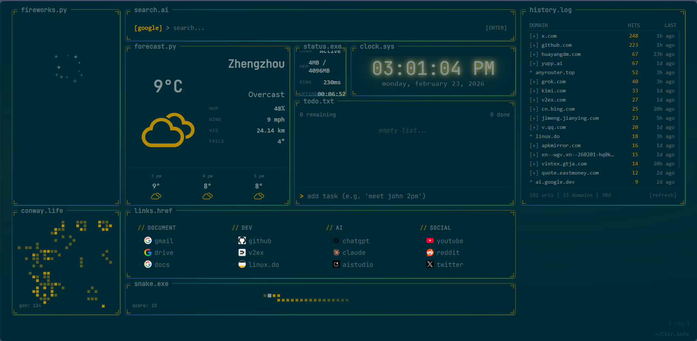
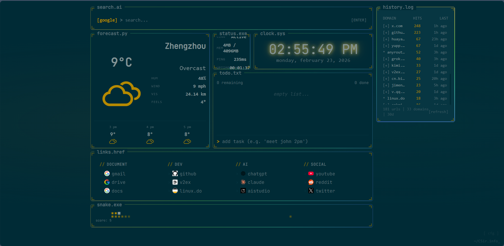
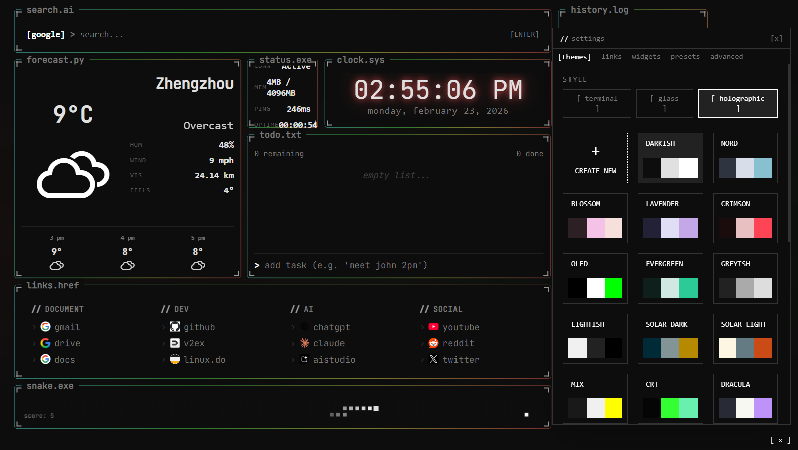

<p align="center">
  
</p>

<h1 align="center">term-tab</h1>

<p align="center">
  专为专注与效率打造的复古风格、模块化新标签页仪表盘。
</p>

<p align="center">
  
</p>

---

## 功能特性

- **模块化组件** — 按需启用时钟、天气、待办、统计、历史记录等组件
- **多主题支持** — 内置多套主题，包含全新加入的两套主题风格
- **历史记录组件** — 新增浏览历史小组件，快速回顾最近访问页面
- **Todoist 集成** — 将待办组件与 Todoist 云端同步
- **本地优先** — API Token 仅存储于本地浏览器，不上传至任何第三方

---

## 主题

<p align="center">
  
</p>

此版本新增了两套主题，可在设置页面的「主题」选项卡中切换。所有主题均支持实时预览，无需刷新。

---

## 历史记录组件

新增 **History（历史记录）** 小组件，自动记录并展示最近浏览的页面链接，方便快速导航。可在设置中的「组件」选项卡中启用或关闭。

---

## 设置页面

<p align="center">
  
</p>

鼠标悬停至页面右上角即可呼出设置面板，支持对组件、主题、高级选项进行个性化配置。

---

## 安装（Edge / Chrome）

1. 打开 `edge://extensions`（或 `chrome://extensions`）
2. 启用右上角的**开发者模式**
3. 点击**加载已解压的扩展程序**
4. 选择项目中的 `extension` 文件夹

---

## Todoist 集成

将待办组件与 Todoist 账户绑定，实现云端同步。

1. 进入 **设置 > 高级 > 待办组件**
2. 开启 **与 Todoist 同步**
3. 粘贴你的 API Token（在 [todoist.com](https://todoist.com) 的 设置 > 集成 > 开发者 中获取）
4. 在弹窗中授权相应权限

**自然语言截止日期** — 创建任务时可直接输入日期描述：

| 输入内容                  | 任务名称     | 截止时间      |
| ------------------------- | ------------ | ------------- |
| `明天下午2点和 John 开会` | 和 John 开会 | 明天下午 2:00 |
| `下周一买菜`              | 买菜         | 下周一        |
| `每周五给妈妈打电话`      | 给妈妈打电话 | 每周五        |
| `1月15日提交报告`         | 提交报告     | 1月15日       |

日期解析由 Todoist NLP 引擎处理。本地模式仍支持时间语法（如 `standup 9am`）。

---

## 构建

### 环境要求

- Node.js v16+
- Python 3

### 构建步骤

1. 安装依赖：

```
npm install
```

2. 构建项目：

```
npm run build
```

构建脚本会自动将产物同步至 `extension/` 目录。

3. 打包扩展：

```
python scripts/package_addon.py
```

输出文件：`terminal-start-v1.0.0.zip`

### 运行测试

```
npx playwright test
```

使用 Chromium 对扩展进行端到端测试。

---

## 注意事项

- 鼠标悬停至页面右上角可打开设置面板。
- 所有 API Token 仅保存在本地浏览器中，不会发送至除 Todoist 之外的任何服务器。
